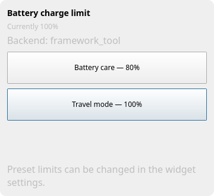
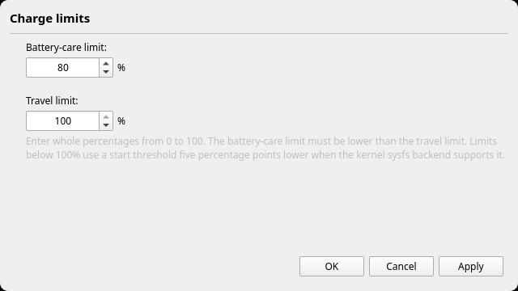

# Framework Charge Limit for KDE Plasma 6

A small Plasma 6 widget that switches the battery charge limit of a Framework
Laptop between **80% battery care** and **100% travel mode**. It automatically
selects the standard Linux sysfs backend when available and otherwise falls
back to Framework's official `framework_tool`. A one-shot mode can temporarily
charge to 100% and restore the battery-care limit when external power is
unplugged.

## Screenshots

### Charge controls



### Configurable presets



## Features

- compact panel display showing the current limit or `?`,
- standalone application launcher with its own Task Manager icon,
- two one-click presets configurable from 0% to 100% in Plasma's widget settings,
- one-shot 100% charging with automatic restore after external power is unplugged,
- pending restore state survives Plasma restarts, logout, suspend, and reboot,
- automatic backend detection with the active backend visible in the UI,
- displays any existing 0–100% BIOS/EC or sysfs limit, not only its presets,
- native `charge_control_*_threshold` support with five-point hysteresis,
- `framework_tool` fallback for machines without the kernel interface,
- never mixes the two charge-control APIs,
- reads the actual limit back after changes,
- follows the active Plasma color scheme,
- English source UI with a bundled Czech translation,
- no password prompts after the optional helper installation,
- safe PolicyKit fallback when only the `.plasmoid` UI package is installed.

## Requirements

- a supported Framework Laptop,
- Linux with KDE Plasma 6,
- `framework_tool` from the `framework-system` package for the fallback backend,
- `plasma5support` (for Plasma's executable data engine),
- PolicyKit and `pkexec`,
- systemd and udev for one-shot automatic restore.

On Arch Linux and Manjaro:

```bash
sudo pacman -S framework-system plasma5support polkit
```

## Install from source

```bash
git clone https://github.com/vojtabiberle/framework-charge-limit.git
cd framework-charge-limit
./install.sh
```

The installation asks for administrator authentication once. Then add
**Framework Charge Limit** from Plasma's **Add Widgets…** panel. It can also be
opened as a standalone window from the application launcher; that window has a
dedicated Framework Charge Limit icon in Plasma's Task Manager.

### Upgrading from a pre-1.0 version

Version 1.0 adopts the stable widget ID
`com.github.vojtabiberle.frameworkchargelimit`. The installer keeps the old
package temporarily so an existing panel is not left with a broken widget.
Remove the old panel instance and add **Framework Charge Limit** again; your two
preset values can then be entered in the new widget settings.

## Languages

English is the source language and is always available. A Czech translation is
bundled in the package. Translation sources live in `po/`; contributors can
copy `po/cs.po` for a new locale and translate its `msgstr` entries.

After editing a translation, rebuild the binary catalogs with:

```bash
./update-translations.sh
```

Maintainers can refresh the translation template from the QML sources with
`./Messages.sh`. Both commands require GNU gettext.

## Why a privileged helper?

Writing sysfs thresholds and using `framework_tool` both need root access. The
installed helper is owned by root and accepts only documented subcommands or a
strictly validated integer from 0 through 100. It detects the same backend as
the widget, uses sysfs whenever available, and never calls `framework_tool` in
that mode. A PolicyKit rule lets the active local desktop user run this helper
without repeated password prompts. It does not allow arbitrary commands, paths,
or out-of-range values.

One-shot mode stores only the validated restore percentage in the root-owned
`/var/lib/framework-charge-limit` directory. A narrow udev rule asks systemd to
start the restore service when a power source goes offline; the helper restores
the saved limit only when no external source remains online. The same systemd
oneshot service runs at boot, covering an unplug while the machine was suspended
or powered off. Manual preset changes cancel a pending automatic restore.

For the sysfs backend, a limit below 100% uses a start threshold five percentage
points lower than the end threshold. The 100% preset writes 0% and 100%, which
disables the standard EC sustain range. Systems exposing only the end threshold
are also supported.

Review these files before installing:

- `system/framework-charge-limit`
- `system/com.github.vojtabiberle.frameworkchargelimit.policy`
- `system/90-framework-charge-limit.rules`
- `system/framework-charge-limit-restore.service`
- `desktop/com.github.vojtabiberle.frameworkchargelimit.desktop`
- `desktop/com.github.vojtabiberle.frameworkchargelimit.svg`

## Build a distributable package

```bash
./build-package.sh
```

This creates `dist/framework-charge-limit-VERSION.plasmoid`. The `.plasmoid`
contains the UI only. KDE Store packages cannot perform privileged setup on
their own. Reading sysfs remains unprivileged; writes use `pkexec tee`. The
`framework_tool` fallback uses its normal PolicyKit prompt. Running `install.sh`
once adds the restricted helper and removes those repeated prompts.

## Uninstall

```bash
./uninstall.sh
```

Uninstalling intentionally leaves the last charge limit unchanged in firmware.

## Security

The widget never passes unchecked user-supplied text to a shell. Its UI invokes
only the fixed helper path with fixed subcommands or a validated integer from 0
through 100.
Sysfs paths are discovered only under `/sys/class/power_supply/BAT*` and
strictly validated by the UI. The helper is installed root-owned and validates
the argument again before writing sysfs or invoking `/usr/bin/framework_tool`
by its absolute path.

## License

MIT
